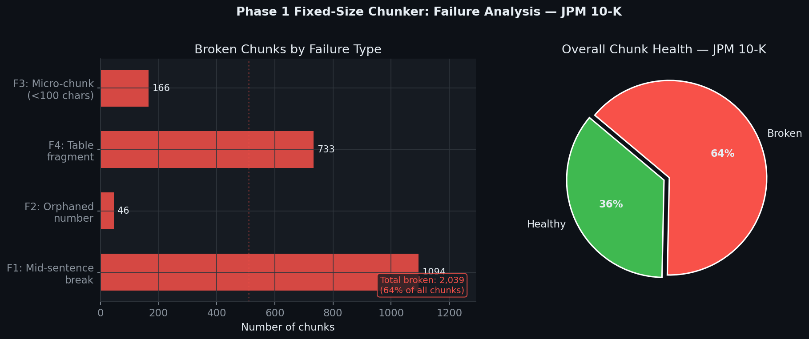
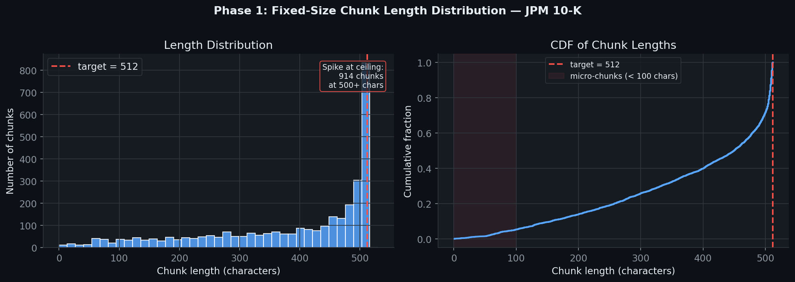
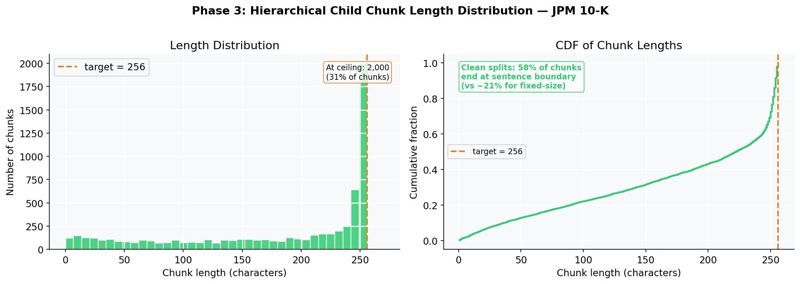
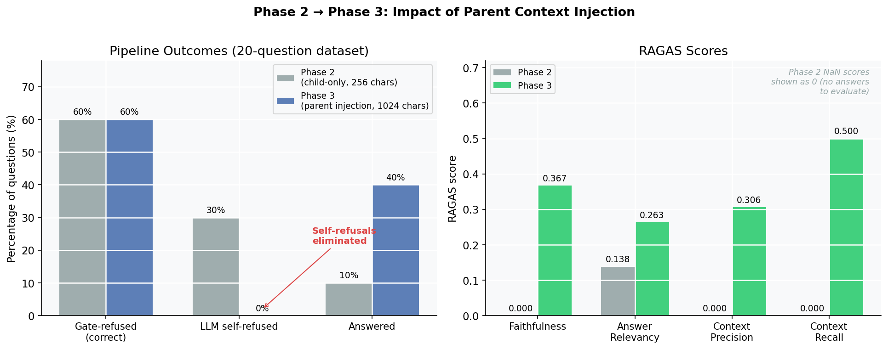

# Quaestor

> Natural language search for SEC filings and financial standards — with cited, hallucination-checked answers.


Financial analysts spend hours navigating 300-page 10-K filings to find specific disclosures. Quaestor turns that into seconds — with a natural language question, a cited answer, and a confidence gate that refuses rather than guesses when the answer isn't there.

Quaestor sits at the boundary between search and reasoning. It is not a chatbot wrapper around a PDF, and it does not attempt to replace platforms like Bloomberg or AlphaSense. The engineering question it answers is narrower and harder: how do you build a retrieval system precise enough to cite a source, and disciplined enough to refuse when the evidence isn't there? The primary constraint is correctness, not fluency — and that changes every architectural decision. The full reasoning behind these choices is in the [case study](docs/case_study.md).

---

## Table of Contents

- [Demonstration](#demonstration)
- [What It Does](#what-it-does)
- [Who Is This For](#who-is-this-for)
- [How It Works](#how-it-works)
- [The Chunking Problem — Visualised](#the-chunking-problem--visualised)
- [Results](#results)
- [Stack](#stack)
- [Installation](#installation)
- [Usage](#usage)
- [Tests](#tests)
- [Project Structure](#project-structure)
- [Roadmap](#roadmap)
- [Internal References](#internal-references)
- [External References](#external-references)
- [License](#license)

---

## Try It

**[→ Live static demo](https://quaestor-static.streamlit.app/)** — no setup required.

Pre-computed responses from the 20-question golden evaluation dataset, running on the Apple FY2025 10-K. Switch between **Phase 2** (child-only retrieval, high refusal rate) and **Phase 3** (parent injection, refusals eliminated) in the sidebar to see the architectural difference directly.

> All responses are real — generated by actual pipeline runs and stored in `eval/results/`. No Ollama, no API key, no ChromaDB needed.

The full interactive app (requires Ollama + Groq key + indexed documents):

```bash
uv run streamlit run app.py
```

---

## Demonstration

**Question:** *"What was Apple's net income in FY2025?"*

| System | Response |
|--------|----------|
| **Baseline** (fixed-size chunking) | *(LLM self-refusal — insufficient context to answer)* |
| **Quaestor** | `Apple's net income for FY2025 was $93,736 million. [Source: aapl-10k-2025.txt, Page 31]` |

**Question:** *"What was Apple's revenue from a fiscal year not in the index?"*

| System | Response |
|--------|----------|
| **Quaestor** | `I cannot find this information in the indexed filings.` *(confidence gate fires — no LLM call made)* |

The system answers when it can, refuses when it can't, and never fabricates.

---

## What It Does

Quaestor indexes SEC 10-K filings and regulatory standards and lets you query them in plain English:

- **Cited answers** pinned to source document and page number
- **Hallucination detection** — every generated answer checked against retrieved context before returning
- **Confidence gating** — low-confidence retrievals are refused outright rather than sent to the LLM
- **Table-aware chunking** — hierarchical retrieval preserves column headers and row context that fixed-size chunking destroys
- **PII redaction** — queries are screened before any external call

Indexed documents: Apple, JPMorgan Chase, Johnson & Johnson, ExxonMobil, Walmart 10-Ks; IFRS 9/15/16; PCAOB AS 2101/2201.

---

## Who Is This For

Financial analysts, auditors, and researchers who need to quickly locate specific disclosures, figures, or policy language in dense regulatory documents — without manually scrolling through hundreds of pages or trusting an LLM to answer without evidence.

---

## How It Works

At a high level:

```
Query → PII check → Retrieve relevant chunks → Rerank & score confidence
    → [Refuse if low confidence]
    → Expand to full table context → Generate cited answer → Hallucination check → Return
```

The key design choices and why they exist:

| Component | Problem It Solves |
|-----------|------------------|
| **Hierarchical chunking** | Fixed-size chunks bisect financial tables, stripping column headers from data. Small chunks (256 chars) keep retrieval precise; parent windows (1024 chars) give the LLM complete table context. |
| **Cross-encoder reranking** | Embedding similarity alone doesn't distinguish "close but wrong" from "exact match." The cross-encoder scores each (query, chunk) pair directly. |
| **Confidence gate** | A low reranking score means the answer probably isn't in the index. Refusing is safer than hallucinating in a financial context. |
| **NLI hallucination check** | Catches cases where the LLM generates a claim not supported by the retrieved context — a second line of defense after the confidence gate. |
| **Parent context injection** | The retrieval unit (256-char child) and the generation unit (1024-char parent window) are decoupled. This eliminated all LLM self-refusals in evaluation. |

<details>
<summary>Full pipeline diagram</summary>

```
User Query
    │
    ▼
[PII Detection — Presidio]
    │
    ▼
[Dense Retrieval — nomic-embed-text → ChromaDB / Qdrant]
    │  top-k child chunks (256 chars, retrieval-optimized)
    ▼
[Cross-Encoder Reranking — ms-marco-MiniLM-L-6-v2]
    │  confidence score per (query, chunk) pair
    ▼
[Confidence Gate]
    ├─ score < threshold → Refuse (no LLM call)
    └─ score ≥ threshold ─────────────────────────────────────┐
                                                              ▼
                                              [Parent Context Injection]
                                              1024-char parent windows
                                                              │
                                                              ▼
                                              [Groq Llama 3.3 70B — generation]
                                              Citation enforcement in prompt
                                                              │
                                                              ▼
                                              [NLI Hallucination Check — DeBERTa-v3]
                                                              │
                                                              ▼
                                              Cited Answer + Source References
```

Every query is traced end-to-end via Langfuse (retrieval → rerank → gate → generate → NLI).

</details>

---

## The Chunking Problem — Visualised

The core engineering challenge is that financial documents break naïve chunkers badly. Here's the evidence from a real JPMorgan Chase 10-K filing.

### Act 1 — 64% of fixed-size chunks are structurally broken



Fixed-size chunking produces mid-sentence cuts, orphaned numbers, table fragments, and micro-chunks. Nearly two-thirds of chunks from a real 10-K are unusable for precise retrieval.

### Act 2 — The mechanism: the splitter always hits its ceiling



The spike at 512 characters is the tell. The splitter hits its size limit and cuts regardless of sentence or table boundaries — the distribution is driven by the limit, not the document structure.

### Act 3 — Hierarchical chunking produces a fundamentally different shape



256-char child chunks with sentence-aware splitting. No ceiling spike, no arbitrary cuts. The splitter follows document structure instead of fighting it.

### Act 4 — One architectural change, measurable improvement



Switching from 256-char child fragments to 1024-char parent windows for LLM context: LLM self-refusals drop from 30% to zero, answer rate triples, and RAGAS scores become measurable for the first time.

---

## Results

Phase 3 evaluation on a 20-question golden dataset (60% answerable, 40% unanswerable):

| Metric | Before Parent Injection | After Parent Injection | Change |
|--------|------------------------|------------------------|--------|
| LLM Self-Refusals | 30% | **0%** | Eliminated |
| Answer Rate | 10% | **40%** | +300% |
| Faithfulness | — | **0.367** | Measurable |
| Context Recall | — | **0.500** | Measurable |
| Answer Relevancy | 0.138 | **0.263** | +91% |
| Gate Refusals | 60% | **60%** | Unchanged ✓ |

**What these numbers mean:** The 60% gate refusal rate is correct — those are genuinely unanswerable questions about fiscal years and metrics not present in the indexed filings. RAGAS averages across all 20 questions, so correct refusals suppress the aggregate score. The architecture is validated; Phase 4 expands to 120 questions with a more balanced answerable/unanswerable split to produce cleaner headline metrics.

The system moved from *unreliable* (30% self-refusal, near-zero RAGAS) to *usable* (0% self-refusal, measurable faithfulness and recall) with a one-line change: using 1024-char parent windows for LLM context instead of 256-char retrieval chunks.

---

## Stack

| Component | Choice | Reason |
|-----------|--------|--------|
| **LLM** | Groq Llama 3.3 70B | 300 tok/s vs ~15 tok/s local on M1 — 20× dev speedup, free tier |
| **Embeddings** | nomic-embed-text (Ollama) | Local, free, outperforms Ada-002 on MTEB |
| **Vector store** | ChromaDB → Qdrant | Zero-config for CI; Qdrant adds hybrid BM25+dense for production |
| **Framework** | LangChain + LangGraph | LCEL chains; LangGraph for multi-step confidence gate logic |
| **Evaluation** | RAGAS | Faithfulness, context precision/recall, answer relevancy |
| **Observability** | Langfuse (self-hosted) | Per-query traces, latency, confidence score distribution |
| **Guardrails** | Presidio + DeBERTa NLI | PII redaction pre-query; entailment check post-generation |
| **API** | FastAPI + SSE | Sync and streaming endpoints |

> **Hardware constraint:** Development on a 2020 M1 MacBook Air (8 GB). Embeddings run locally (nomic-embed-text, 270 MB); LLM calls offloaded to Groq. The 20× throughput difference compounds significantly over weeks of iteration.

---

## Installation

### Prerequisites

- Python 3.11+
- [`uv`](https://github.com/astral-sh/uv)
- [Ollama](https://ollama.ai/) running locally (for embeddings)
- Groq API key — free tier at [console.groq.com](https://console.groq.com)

### Local Setup

```bash
git clone https://github.com/yourusername/quaestor.git
cd quaestor

uv sync

cp .env.example .env
# Set GROQ_API_KEY at minimum

ollama pull nomic-embed-text

# Index a document
uv run python scripts/index_document.py --ticker AAPL

# Start the API
uv run uvicorn quaestor.api.main:app --reload
```

### Docker (Full Stack)

```bash
cp .env.example .env  # Set GROQ_API_KEY

docker-compose up -d

# API docs:  http://localhost:8000/docs
# Langfuse:  http://localhost:3000
```

First-time Langfuse setup: create a local account at `localhost:3000`, create a project called "Quaestor", copy the Public/Secret keys into `.env`, then `docker-compose restart quaestor-api`.

**Note:** Ollama must be running on the host (Docker reaches it via `host.docker.internal`).

---

## Usage

```bash
# Synchronous query
curl -X POST http://localhost:8000/ask \
  -H "Content-Type: application/json" \
  -d '{"question": "What was Apple net income in FY2025?"}'

# Response
{
  "answer": "Apple's net income for fiscal year 2025 was $93,736 million. [Source: aapl-10k-2025.txt, Page 31]",
  "refused": false,
  "sources": ["aapl-10k-2025.txt"],
  "hallucination": {"is_hallucination": false, "label": "ENTAILMENT"}
}

# Streaming (Server-Sent Events)
curl -X POST http://localhost:8000/ask/stream \
  -H "Content-Type: application/json" \
  -d '{"question": "What was Apple net income in FY2025?"}'
```

---

## Tests

```bash
# Full suite (305 tests, ~6s)
uv run pytest tests/ -v

# Unit tests only (offline, no external services)
uv run pytest tests/unit/ -v

# Integration tests (requires Ollama + Groq)
uv run pytest tests/integration/ -v

# RAGAS evaluation
uv run python scripts/evaluate.py --output eval/results/latest.json
```

Unit tests use `FakeLLM` and `FakeEmbeddings` — zero external service dependencies in CI.

---

## Project Structure

```
quaestor/
├── src/quaestor/
│   ├── config.py              # All settings via pydantic-settings
│   ├── ingestion/             # PDF loading, hierarchical chunking, indexing
│   ├── retrieval/             # Dense retrieval, cross-encoder reranking, LangGraph
│   ├── generation/            # RAG chain, prompts, citation enforcement
│   ├── guardrails/            # PII detection (Presidio), NLI hallucination check
│   └── api/                   # FastAPI: /ask, /ask/stream, /health
├── tests/                     # 305 unit + integration tests
├── eval/
│   ├── golden_dataset.json    # 20-question ground-truth dataset (frozen)
│   ├── results/               # RAGAS baselines per phase
│   └── harness/               # Resilient eval harness with key rotation
├── scripts/                   # index_document.py, evaluate.py
├── docs/                      # Case study, architecture notes
├── Dockerfile
├── docker-compose.yml
└── .env.example
```
---

## Roadmap

- [x] Phase 1: Fixed-size chunking baseline (123 tests)
- [x] Phase 2: Hierarchical chunking, cross-encoder reranking, LangGraph confidence gate, NLI guardrail, FastAPI (182 additional tests)
- [x] Phase 3: Parent context injection — LLM self-refusals eliminated, RAGAS measurable
- [x] RAGAS evaluation harness with checkpoint-restart
- [ ] Phase 4: Golden dataset expansion (20 → 120 questions)
- [ ] Phase 5: Threshold calibration + Qdrant hybrid retrieval
- [ ] Phase 6: GitHub Actions CI — eval gate on PRs, quality ratchet

---

## Internal References

- [Case Study](docs/case_study.md)
- [Phase 3 Before/After](eval/results/COMPARISON.md)

---

## External References

### Core RAG Framework
- Lewis, P., et al. (2020). *Retrieval-Augmented Generation for Knowledge-Intensive NLP Tasks*.  
  https://arxiv.org/abs/2005.11401

### Evaluation
- Shah, R., et al. (2023). *RAGAS: Automated Evaluation of Retrieval Augmented Generation*.  
  https://arxiv.org/abs/2309.15217

### Long Context Limitations
- Liu, N. F., et al. (2023). *Lost in the Middle: How Language Models Use Long Contexts*.  
  https://arxiv.org/abs/2307.03172

### Retrieval and Reranking
- Nogueira, R., & Cho, K. (2019). *Passage Re-ranking with BERT*.  
  https://arxiv.org/abs/1901.04085

### Hallucination / Reliability
- Manakul, P., et al. (2023). *SelfCheckGPT: Zero-Resource Black-Box Hallucination Detection*.  
  https://arxiv.org/abs/2303.08896

---

### Industry Context

- [AlphaSense](https://www.alpha-sense.com/) — AI-powered financial document search and analysis
- [Bloomberg Terminal](https://professional.bloomberg.com/products/bloomberg-terminal/) — comprehensive financial data and analytics platform
- [LSEG Data & Analytics](https://www.lseg.com/en/data-analytics) — financial market data and infrastructure (formerly Refinitiv)

---

### Optional (Further Reading)

- Zhang, Y., et al. (2023). *A Survey of Hallucination in Large Language Models*.
  https://arxiv.org/abs/2309.01219
---

## License

MIT — free for educational use.
